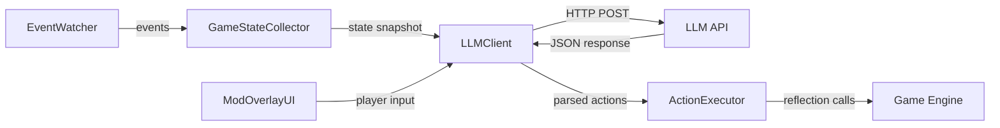

# GiantessLLMMod — Walkthrough

## What Was Built

A complete BepInEx mod for **Giantess Sandbox** (Unity 2019.4, Mono) that:
1. **Reads** real-time game state (player HP, position, stomach status; giantess emotions, hunger, memories)
2. **Sends** structured context to any OpenAI-compatible LLM
3. **Executes** the LLM's response as in-game actions, emotions, and dialogue

## Architecture

---

## Key Files

| File | Purpose |
|------|---------|
| [Plugin.cs](file:///d:/Games/GaintessSandBox/Workdir-BepInEx/GiantessLLMMod/Plugin.cs) | Main entry — integrates all systems, has reflection probe |
| [GameStateCollector.cs](file:///d:/Games/GaintessSandBox/Workdir-BepInEx/GiantessLLMMod/Core/GameStateCollector.cs) | Reflection-based state collection from live Unity objects |
| [LLMClient.cs](file:///d:/Games/GaintessSandBox/Workdir-BepInEx/GiantessLLMMod/Core/LLMClient.cs) | Async HTTP client (ThreadPool) with history management |
| [ActionExecutor.cs](file:///d:/Games/GaintessSandBox/Workdir-BepInEx/GiantessLLMMod/Core/ActionExecutor.cs) | Maps LLM responses → qGts_ method calls via reflection |
| [EventWatcher.cs](file:///d:/Games/GaintessSandBox/Workdir-BepInEx/GiantessLLMMod/Core/EventWatcher.cs) | Detects state transitions (swallowed, picked up, etc.) |
| [ConfigManager.cs](file:///d:/Games/GaintessSandBox/Workdir-BepInEx/GiantessLLMMod/Core/ConfigManager.cs) | BepInEx config with system prompt generation |
| [ModOverlayUI.cs](file:///d:/Games/GaintessSandBox/Workdir-BepInEx/GiantessLLMMod/UI/ModOverlayUI.cs) | IMGUI overlay (Status/Chat/Config/Log tabs) |
| [ActionDefinitions.cs](file:///d:/Games/GaintessSandBox/Workdir-BepInEx/GiantessLLMMod/Models/ActionDefinitions.cs) | 23 actions + 28 emotions with exact enum values |

---

## Probe-Calibrated Data

> [!IMPORTANT]
> All field and method names were validated against **live probe output** (610KB JSON from the running game). No assumptions.

### Player State (from FPSBehaviour)
| Field | Type | Purpose |
|-------|------|---------|
| `_health` | float | Current HP |
| `maxHealth` | float | Max HP |
| `m_IsDead` | bool | Death state |
| `m_InStomach` | bool | Inside stomach |
| `m_BeingSwallowed` | bool | Being swallowed |
| `isGrabbed` (FirstPersonAIO) | bool | Being held |
| `m_IsInMouth` (ReimuAnimationController) | bool | In mouth |

### Giantess State (from GiantessAI)
| Field | Type | Purpose |
|-------|------|---------|
| `m_State` | enum | Current AI state (IDLE, GTSSCRIPT, etc.) |
| `m_Hunger` | float | Hunger level (0~1) |
| `m_Horniness` | float | Horniness (0~100) |
| `m_Stomach` → `m_Activity` | float | Stomach activity |
| `m_Stomach` → `m_BurpBuildUp` | float | Burp pressure |
| `m_Stomach` → `m_AcidFillAmount` | float | Acid level |

### Key Methods
| Method | Signature |
|--------|-----------|
| `Say` | `Say(String pText, SoundLoudness eLoudness)` |
| `qGts_SetFaceFlex` | `(Action, Config, EyesFlexType, MouthFlexType, bool, bool, bool)` |
| `qGts_PickUp` | `(Action, Action, bool×19...)` |
| `qGts_EatHeldObject` | `(bool, bool, Config, bool×7, Action)` |
| `qGts_PatStomach` | `(Action, float duration, Config)` |
| `Burp` | `(bool lookAtStomach, bool skipGrowl, float blush, Action onDone)` |

### Expression Enums
- **EyesFlexType**: EYES_NORMAL, EYES_ANGRY, EYES_HAPPY, EYES_CURIOUS, EYES_HORNY, EYES_EXCITED, EYES_SURPRISED, EYES_UPSET_SHY, EYES_CRAZY, EYES_INTEREST, EYES_PLEASURE, EYES_PLAYFUL, EYES_HORNY2, EYES_SHUT_TIGHT, EYES_SAD, EYES_CRY, EYES_CLOSED, EYES_INTENSE_STARE, EYES_CLOSED_SAD
- **MouthFlexType**: MOUTH_NORMAL, MOUTH_HAPPY, MOUTH_ANGRY, MOUTH_SMILE, MOUTH_CURIOUS, MOUTH_EXCITED, MOUTH_OPEN, MOUTH_GRIN, MOUTH_GRIN_BLUSH, MOUTH_FROWN, MOUTH_UPSET_SHY, MOUTH_CRAZY, MOUTH_INTEREST, MOUTH_SHOW, MOUTH_SMILE_BLUSH, MOUTH_YUMMY, MOUTH_LICK_UP, MOUTH_PRE_BURP, MOUTH_HUNGRY, MOUTH_SMIRK, MOUTH_SMIRK2, MOUTH_HUNGRY2, MOUTH_LICK_LIPS, MOUTH_SHOW_TONGUP, MOUTH_SWALLOW, MOUTH_TINYINLIPS, MOUTH_OPEN_REAL, MOUTH_SIDESMILE, MOUTH_SMALL_GRIN, MOUTH_TRIANGLE

---

## How To Use

### Quick Start
1. Launch game with BepInEx installed
2. Press **F8** → opens overlay UI
3. Go to **Config** tab → set your LLM API URL and key
4. Enter a level with a giantess
5. Press **F7** → manual LLM trigger, or wait for auto-trigger (every 15s)

### Chat
- Type in the **Chat** tab to send player messages to the LLM
- Giantess responses appear in gold color
- Events (swallowed, picked up, etc.) appear in gray

### Configuration
Edit `BepInEx/config/com.giantess.llmmod.cfg` or use the in-game Config tab:
- **API URL**: `http://127.0.0.1:1234/v1` for LM Studio, or any OpenAI-compatible endpoint
- **Dry-run mode**: Test without LLM connection
- **Auto-trigger**: 15s default, accelerates to 5s on events

---

## Verification

- [x] Compiled: 0 errors, 0 warnings
- [x] Deployed to `BepInEx/plugins/GiantessLLMMod.dll`
- [x] Probe ran successfully: 27 classes, 15 enums, 262 relevant types
- [x] All field/method names calibrated from probe data
- [ ] Pending: In-game testing with actual LLM
